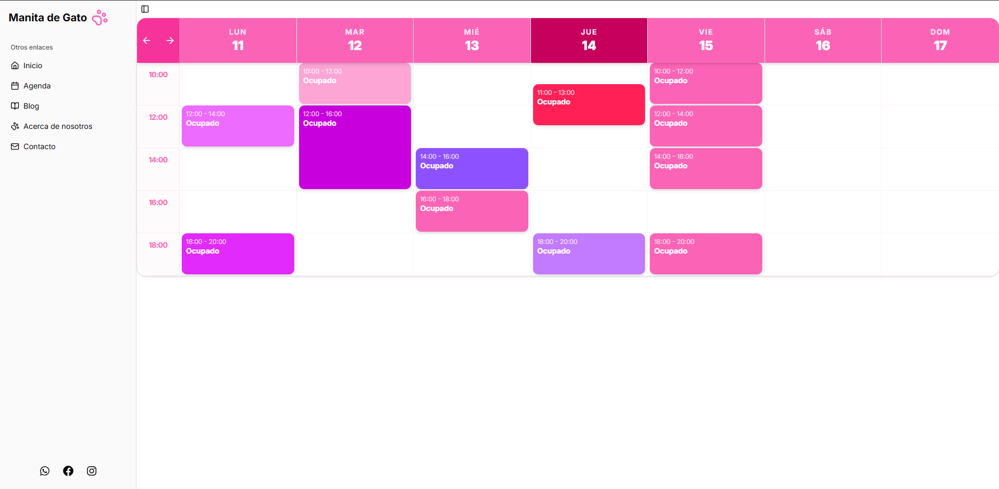
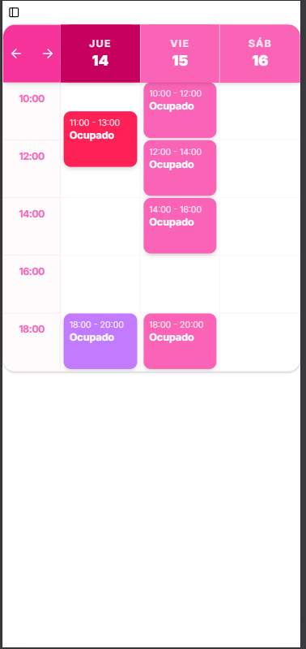

📋 About the Project

This project is a Minimum Viable Product (MVP) digital solution built to replace manual, message-based appointment scheduling. The system empowers clients to view real-time availability, book services, and connect seamlessly with the administration through an automated WhatsApp bridge.

✨ Key Features (Phase 1)

📅 Smart Booking Engine: Validates real-time availability to prevent double-booking and schedule collisions.

📱 WhatsApp Bridge: Upon booking, automatically redirects the user to WhatsApp with a pre-filled message containing their appointment details, eliminating communication friction.

🔐 Admin Dashboard: A private control panel to visualize daily appointments, update statuses (Pending, Confirmed, Canceled), and block out specific days or holidays.

🛡️ Strict Data Validation: Utilizes Zod on the backend to ensure data integrity and prevent corrupt entries into the database.

📸 Screenshots

Client View (Booking Interface)

Agenda

User-friendly interface for seamless date and time selection.

Private view for comprehensive business management.

🛠️ Tech Stack

Frontend: React (Next.js App Router)

Styling: Tailwind CSS + Shadcn/ui (optional)

Backend: Next.js Route Handlers (REST API)

Database: PostgreSQL (Hosted on Supabase)

Validation: Zod

🚀 Installation & Local Development

To run this project locally, follow these steps:

Clone the repository:

git clone [https://github.com/Jota-ato/manita-de-gato](https://github.com/Jota-ato/manita-de-gato)

Install dependencies:

pnpm install

Configure environment variables:
Create a .env.local file in the root directory based on the provided example (if available) and add your Supabase keys:

NEXT_PUBLIC_SUPABASE_URL=your_supabase_url_here
NEXT_PUBLIC_SUPABASE_ANON_KEY=your_supabase_anon_key_here

Start the development server:

pnpm run dev

Open http://localhost:3000 in your browser to view the application.